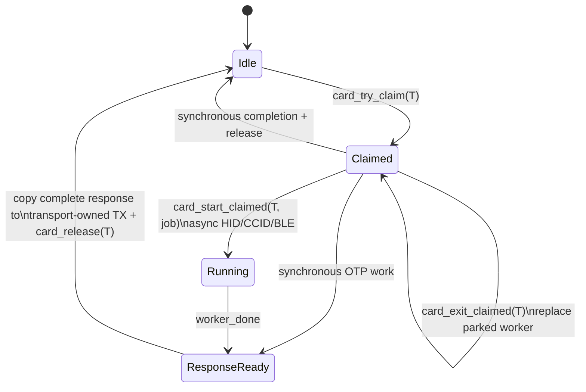
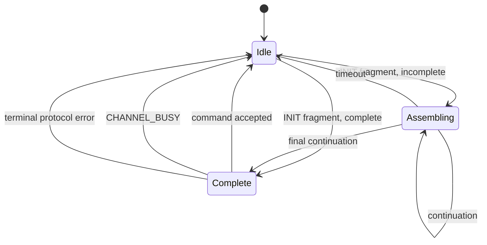
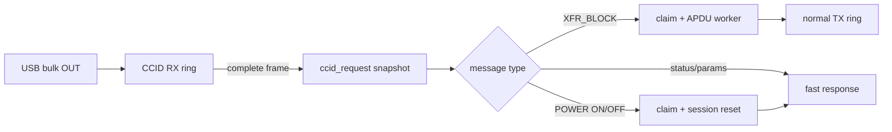
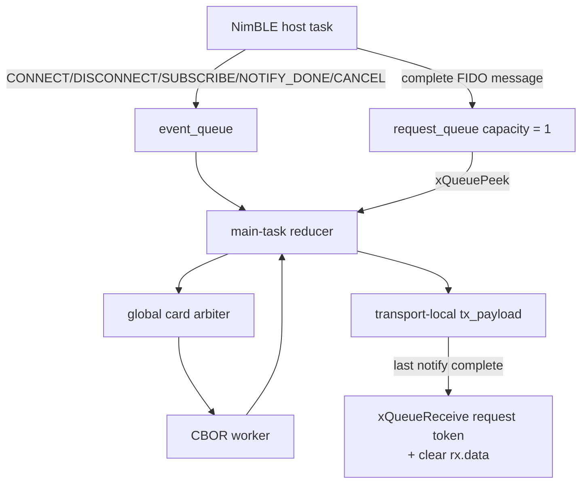
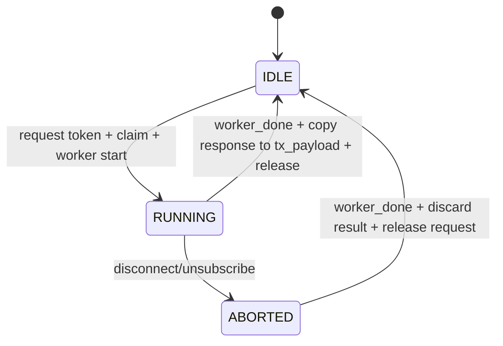
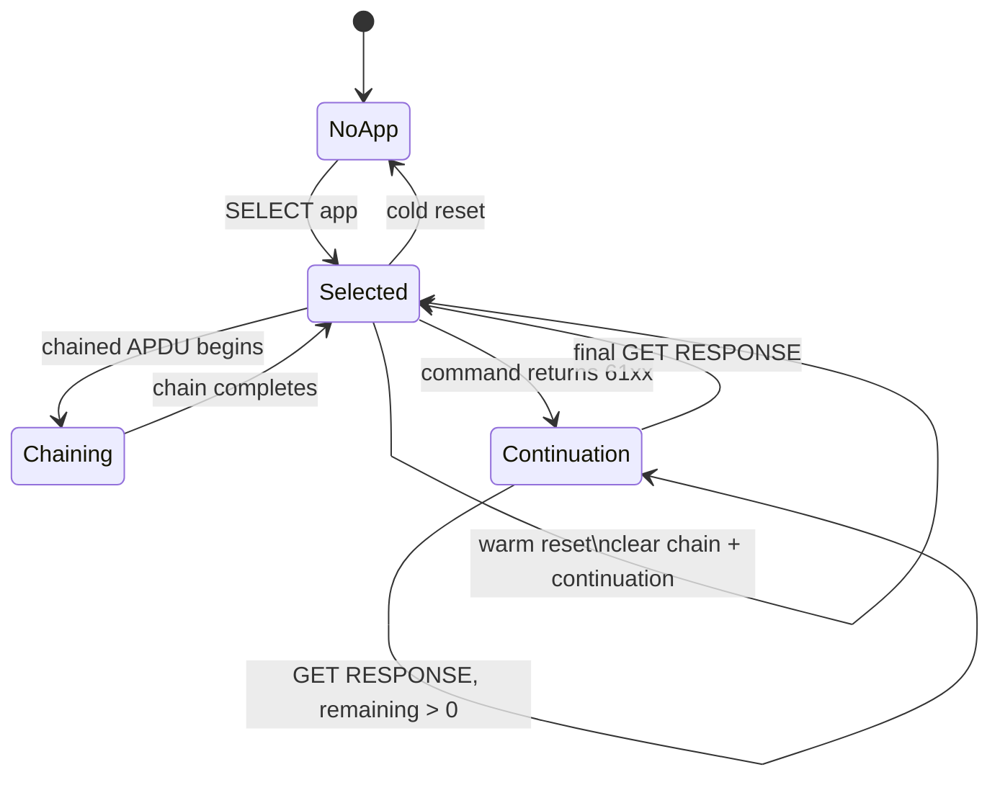
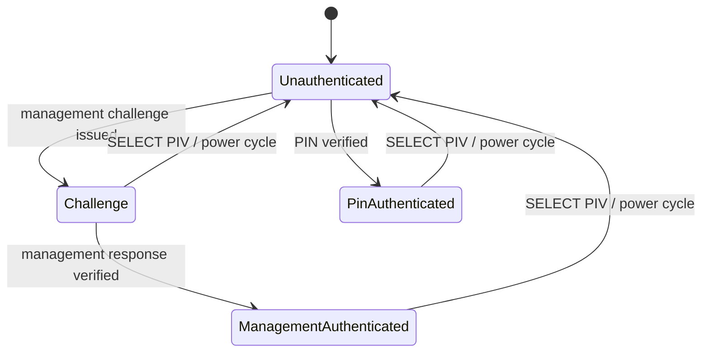

# Transport Ownership State Machine

This document defines the ownership and lifecycle contracts for the product firmware transports. It is the human-readable counterpart of:

- `tests/formal_state_model.py`: explicit-state exhaustive model.
- `tests/source_ownership_contracts.py`: structural contracts over the product C implementation.
- `tests/host_protocol_smoke.py`: cross-transport protocol regression.
- ASAN/UBSAN and ThreadSanitizer host builds.
- The ESP32-S3 target build.

The Python state model is a formal model of the intended finite-state protocol, not a proof of the compiled C binary. The implementation is connected to the model by source contracts, sanitizer runs, protocol tests, and target compilation.

## 1. Global command arbiter

All code that mutates the shared APDU/CBOR execution context must first own the global card command.



A parked worker is separate from command ownership. After a command completes, its task may remain parked on the worker queue even though `owner == NONE`. A later owner may reuse or replace that parked worker, but only through `card_start_claimed()` / `card_exit_claimed()`.

`card_exit_claimed()` is legal only for a parked worker after the previous completion has already been consumed. It is not legal in `RUNNING` or `COMPLETION_PENDING`. This keeps the `EV_EXIT` request/ACK exchange independent from an older completion event instead of relying on queue timing.

### Invariants

1. At most one command owner exists.
2. `RUNNING` and `RESPONSE_READY` imply a non-empty command owner.
3. For an asynchronous command, active worker owner and command owner are identical.
4. Shared `apdu`, `res_APDU`, `cbor_*`, `current_app`, and `finished_data_size` context belongs to the command owner.
5. A non-owner cannot start, replace, or exit a worker.
6. The global owner may be released only after the complete result has been copied into transport-owned response storage.

## 2. Request and response buffer ownership

Transport RX storage is never borrowed after that storage can be reused by its callback or ring.


Rules:

- HID copies every APDU/CBOR request into `msg_packet.data` before async execution.
- HID must arbitrate an existing owner before overwriting `ctap_req_snapshot`. A foreign-owner BUSY/CANCEL path may inspect the current RX frame, but it must not mutate or borrow the snapshot owned by the active worker.
- CCID copies the complete CCID message into `ccid_request[itf].buffer` before advancing the RX ring.
- While a CCID worker owns its request snapshot, later CCID messages remain queued in the RX ring. The parser may not overwrite `ccid_request[itf].buffer` until the worker result has been consumed and the owner released.
- BLE uses a capacity-one request queue as an ownership token. `rx.data` is not reset until the request token is consumed after worker/result/TX lifecycle completion.
- OTP HID executes synchronously while holding the global owner and restores the prior `struct apdu` before release.

## 3. HID transaction state

The HID message assembler is independent from the global command owner.



A complete request receiving `CHANNEL_BUSY` is terminal. It must not remain `Complete`; otherwise the next retry inherits stale payload/sequence state.

`hid_abort_transaction()` is the single explicit abort boundary for owner-arbitration failures.

## 4. HID runtime ownership

TinyUSB HID RX callback has one responsibility: enqueue bytes into the HID RX ring. It does not parse CTAPHID, bind APDU response pointers, or start workers.

Main-task order is:

```text
worker completion
-> copy response / release global owner
-> drain existing HID TX
-> if TX idle, consume next RX report
```

For async commands, CID and command are snapshotted into `active_cid` / `active_cmd`; keepalive and final responses do not borrow the current RX frame.

## 5. CCID runtime ownership

TinyUSB vendor RX callback only enqueues bytes. CCID parsing and worker start happen from `ccid_task()`.



Additional contracts:

- `bSeq` used by async TIMEEXT/final responses is copied into `ccid_active_seq`.
- Fast scratch responses do not advance the normal TX ring cursor.
- POWER_ON/OFF may change APDU/application session state only while holding the command owner.
- The RX callback caps reads to available ring capacity. Overflow is marked and discarded without memory overwrite.

## 6. BLE event reducer

NimBLE host callbacks and the product main task do not jointly mutate the core state machine.

GATT/GAP callback owns only:

- GATT-side connection handle.
- GATT-side subscription state.
- GATT-side revision selection.
- BLE RX fragment assembly under `rx_mutex`.

It publishes events and complete-request tokens to FreeRTOS queues.



Core state:



`tx_active` is transport-local. Once the full response has been copied into `tx_payload`, the global card owner may be released while BLE fragments drain. A new BLE request is still rejected until the existing request token/TX lifecycle is finished.

## 7. OTP HID synchronous path

OTP keyboard feature reports use the same global APDU implementation but do not need an async worker.

```text
feature report complete
-> card_try_claim(ITF_KEYBOARD)
-> save struct apdu
-> bind temporary OTP request/response context
-> otp_process_apdu / otp_status
-> copy result to OTP-owned output
-> restore struct apdu
-> card_release(ITF_KEYBOARD)
```

Both SET_REPORT command execution and GET_REPORT status generation follow this rule.

## 8. APDU transport sessions

CCID, WCID, and HID have separate session state:



Session-owned state includes:

- selected app
- command chaining state
- GET RESPONSE cached bytes
- GET RESPONSE offset/remaining length

GET RESPONSE data is stored in session-owned arrays; it never keeps raw pointers into a transport TX ring.

## 9. PIV security session

PIV authentication state is security-session state, not persistent application state.



Every PIV SELECT and card power-cycle must clear management authentication, outstanding challenge, and PIN-authenticated state.

## 10. Cross-task cancellation and user presence

`cancel_button` and `req_button_pending` are cross-task signals and therefore use atomic load/store APIs.

The worker-side `wait_button()` must never call `execute_tasks()`. Doing so would recursively run USB/BLE transport tasks from the worker while the main task is also running them.

Worker wait behavior is only:

```text
poll physical button
poll atomic cancel
sleep/yield
```

## 11. HWRNG shared state

`random_word`, `hwrng_mix_round`, and the entropy ring head/tail/full/empty fields are one shared object protected by `hwrng_mutex`.

All producers and consumers (`hwrng_task`, `hwrng_get`, `hwrng_flush`, `hwrng_wait_full`) use the same mutex. This contract was added after ThreadSanitizer found a real race between the main task and a CBOR worker calling `random_gen()`.

## 12. USB YubiKey identity

For the YubiKey-compatible profile, PID low bits encode exactly the enabled USB interface set:

| Bit | Interface |
| --- | --- |
| `0x1` | OTP HID |
| `0x2` | FIDO HID |
| `0x4` | CCID |

Valid combinations map one-to-one to `0x0401` through `0x0407`. WebCCID is not part of this profile.

The project release version and the advertised YubiKey firmware version are deliberately separate. The internal product release remains `7.4`, while the compatibility profile advertises `5.7.0` consistently through CTAPHID INIT/VERSION, CTAP2 GetInfo `firmwareVersion`, management, OATH, OTP, BLE Device Information, PIV, and USB `bcdDevice=0x0570`. OpenPGP `3.4` remains the OpenPGP application specification version rather than being rewritten as a device firmware version. `tests/yubikey_profile_contracts.py` enforces these relationships.

Product `sdkconfig*.defaults` are separately checked by `tests/sdkconfig_contracts.py`. Non-comment assignments must be real `CONFIG_...=...` Kconfig entries; component-manager environment variables, malformed pseudo-settings, and deprecated IDF aliases are rejected rather than relying on kconfgen to silently ignore or rewrite them.

## 13. Verification mapping

| Contract | Executable check |
| --- | --- |
| One global owner / worker-owner consistency | `formal_state_model.py` core model |
| Request remains live for worker | core model + source contracts |
| Response copied before owner release | core model + BLE/HID/CCID source contracts |
| Terminal HID BUSY clears transaction | HID transaction model + HID source contract |
| HID worker snapshot cannot be overwritten by BUSY/CANCEL traffic | HID source contract + known-bad regression model |
| CCID active request snapshot cannot be overwritten by a second frame | CCID request-context model + CCID source contract |
| Worker exit cannot precede completion consumption | worker lifecycle model + arbiter/HID source contracts |
| APDU transport-session isolation | APDU model + host protocol smoke |
| GET RESPONSE storage is session-owned | APDU source contract |
| PIV SELECT/power-cycle clears auth | PIV model |
| BLE callback cannot enter core | BLE source contract |
| HID/CCID USB callbacks only enqueue | HID/CCID source contracts |
| OTP feature report holds global owner | OTP source contract |
| Raw worker start/exit cannot bypass owner | arbiter source contract |
| Cross-task button flags are atomic | button source contract |
| HWRNG shared state is serialized | HWRNG source contract + TSan |
| Memory/UB safety on exercised host paths | ASAN + UBSAN |
| Data-race safety on exercised host paths | ThreadSanitizer |
| Product protocol behavior | `host_protocol_smoke.py` |
| YubiKey-facing version/profile consistency | `yubikey_profile_contracts.py` + host CTAPHID version assertion |
| ESP-IDF defaults are real/reproducible Kconfig | `sdkconfig_contracts.py` + target reconfigure |
| Target compatibility | ESP32-S3 build |

Current exhaustive abstract-model coverage after the ownership refactor:

```text
core ownership model:   808 reachable states / 4750 transitions
APDU session model:   17576 reachable states / 476580 transitions
HID transaction model:    3 reachable states / 11 transitions
HID response model:       4 reachable states / 5 transitions
CCID request model:       5 reachable states / 9 transitions
worker lifecycle model:   6 reachable states / 9 transitions
completion/flash model:    7 reachable states / 10 transitions
PIV security model:        6 reachable states / 28 transitions
YubiKey PID model:         7 interface combinations
```

The model also injects known-bad designs and requires every one to violate an invariant. The current gate detects 14/14 negative designs, including early BLE RX clear, disconnect invalidation, release-before-copy, foreign shared-context mutation, unclaimed OTP access, foreign session reset, foreign worker switch, stale HID state after terminal BUSY, maintenance/completion deadlock, silent BLE event-queue loss, stale async HID headers on synchronous responses, CCID active-request snapshot overwrite, and worker exit before completion consumption.

## 14. Required gate before another hardware image is considered

No hardware flash should be requested merely because a local fix compiles. The software gate is:

```text
state-machine / ownership review complete
-> explicit-state model PASS
-> source ownership contracts PASS
-> YubiKey advertised-profile contracts PASS
-> sdkconfig syntax/reproducibility contracts PASS
-> git diff --check PASS
-> normal host protocol smoke PASS
-> HID/CCID contention stress PASS
-> ASAN + UBSAN smoke + contention + hard-power-loss durability PASS
-> ThreadSanitizer smoke + contention + hard-power-loss durability PASS
-> BLE frame sanitizer PASS
-> ESP32-S3 target build PASS
-> only then mark a single image as HIL candidate
```

The complete software gate is intentionally exposed as one command so no individual check can be omitted during an interactive debugging session:

```bash
./tools/test_transport_ownership_gate.sh
```

The normal FIDO host entry point (`tools/test_fido_host_container.sh`) also runs the explicit-state model, source ownership contracts, YubiKey profile contracts, sdkconfig contracts, protocol smoke, and transport contention before the existing FIDO pytest suite. The heavier sanitizer, durability, and ESP32 target build remain in the release/ownership gate above.

Hardware HIL is deliberately outside this software proof boundary. A missing HIL result must remain `pending`; it is not permission to weaken any of the software gates above.
